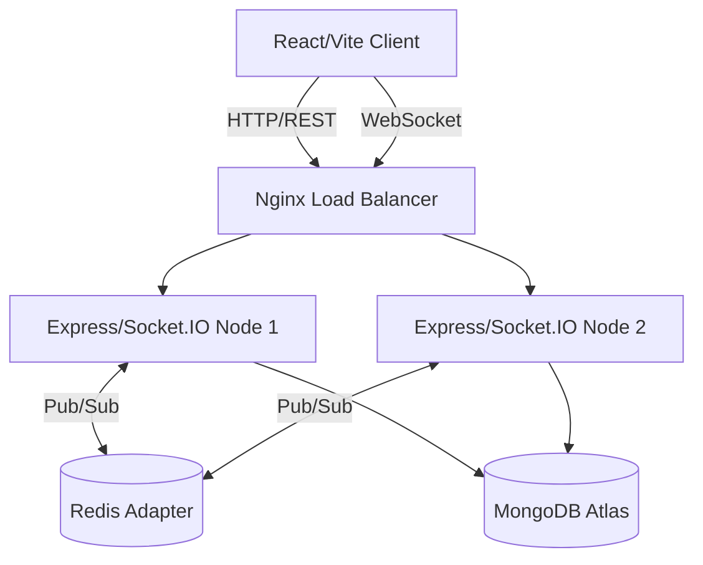

# ChatLance - Comprehensive Production Documentation

## 1. Executive Summary
**ChatLance** is a robust, highly-scalable, production-oriented real-time chat application. It demonstrates advanced backend architectures, modern frontend patterns, and secure communication protocols. The platform supports group chat rooms, direct messaging (DMs), real-time typing indicators, read receipts, and accurate user presence tracking using memory-efficient data structures.

## 2. Architecture & High-Level Design

### 2.1 System Architecture
The application is built on a scalable micro-architecture utilizing Node.js for backend services, React for the client interface, and Redis for pub/sub messaging and state management.



### 2.2 Core Components
- **Client Tier**: React SPA built with Vite, Tailwind CSS, and Lucide Icons. Manages complex state (rooms, active conversations, online users) and socket lifecycle.
- **API Tier**: Express.js REST API protected by JWT and rate limiting.
- **Real-time Engine**: Socket.IO with a custom authentication middleware layer ensuring secure socket connections.
- **Persistence Layer**: MongoDB using Mongoose ORM.
- **Caching & Pub/Sub Layer**: Redis is utilized via the `@socket.io/redis-adapter` to ensure messages are broadcasted correctly across multiple Node.js server instances.

---

## 3. Technology Stack

### 3.1 Frontend Ecosystem
- **React 18**: UI component library.
- **Vite**: Next-generation frontend tooling for rapid HMR and optimized builds.
- **Tailwind CSS 3**: Utility-first styling for rapid UI development.
- **React Router DOM 6**: Client-side routing.
- **Socket.IO Client (v4)**: Real-time bi-directional event-based communication.
- **Axios**: Configured with interceptors for JWT injection.
- **Lucide React**: Lightweight, scalable SVG icon set.

### 3.2 Backend Ecosystem
- **Node.js & Express**: Core server framework.
- **Socket.IO (v4)**: Server implementation.
- **Mongoose**: MongoDB object modeling.
- **JSON Web Tokens (JWT)**: Stateless authorization mechanism.
- **Bcrypt.js**: Cryptographic password hashing.

### 3.3 Security & Infrastructure Tools
- **Helmet**: Secures Express apps by setting various HTTP headers (e.g., XSS Protection, Content Security Policy).
- **Express Rate Limit**: Protects against brute-force attacks and DDoS by limiting request rates.
- **Cors**: Cross-Origin Resource Sharing configuration.
- **Morgan**: HTTP request logger middleware.

---

## 4. Directory Structure

### 4.1 Server (`/server`)
```
server/
├── src/
│   ├── config/          # DB connection (db.js) and Environment variables (env.js)
│   ├── controllers/     # Route logic (auth, rooms, messages, users)
│   ├── middleware/      # Express middlewares (authMiddleware.js)
│   ├── models/          # Mongoose Schemas (User, Room, Message, Conversation, DirectMessage)
│   ├── routes/          # Express route definitions
│   ├── services/        # In-memory services (onlineUsers.js Map)
│   ├── sockets/         # Socket event handlers separated by domain (room, message, direct message)
│   ├── utils/           # Helper functions (jwt.js)
│   ├── app.js           # Express app setup, middleware, and route mounting
│   └── server.js        # HTTP server creation and Socket.IO initialization
```

### 4.2 Client (`/client`)
```
client/
├── src/
│   ├── api/             # Axios instance configuration (axios.js)
│   ├── assets/          # Static assets (images, fonts)
│   ├── components/      # Reusable UI components
│   ├── pages/           # Route-level components (Home, Login, Register, ChatRoom, Profile)
│   ├── App.jsx          # Root component and Router configuration
│   ├── index.css        # Global Tailwind and custom CSS
│   └── main.jsx         # React DOM rendering entry point
```

---

## 5. Database Schema Details (Mongoose)

### 5.1 User Model
- `username`: String, unique, required, min 3 chars.
- `email`: String, unique, required, valid email format.
- `password`: String, required, hashed via `pre('save')` hook.
- `avatar`: String, optional.
- **Methods**: `matchPassword(enteredPassword)` compares bcrypt hashes.

### 5.2 Room Model
- `name`: String, required, unique identifier for the group channel.
- `description`: String, optional.
- `createdBy`: ObjectId (Ref: User).

### 5.3 Message Model (Group Chats)
- `room`: ObjectId (Ref: Room).
- `sender`: ObjectId (Ref: User).
- `message`: String, required.
- `isRead`: Boolean, default `false`.
- `isDeleted`: Boolean, default `false`.

### 5.4 Conversation Model (Direct Messaging)
- `participants`: Array of ObjectId (Ref: User), strictly length 2. Ensures uniqueness between any two users.

### 5.5 DirectMessage Model
- `conversationId`: ObjectId (Ref: Conversation).
- `sender`: ObjectId (Ref: User).
- `message`: String, required.
- `isRead`: Boolean, default `false`.
- `isDeleted`: Boolean, default `false`.

---

## 6. REST API Specification

Base URL: `http://localhost:5000/api`

### 6.1 Authentication (`/auth`)
| Method | Endpoint | Description | Auth Required |
|---|---|---|---|
| POST | `/register` | Creates a new user account. Returns JWT. | No |
| POST | `/login` | Authenticates user. Returns JWT and user object. | No |
| GET | `/me` | Retrieves the currently authenticated user's profile. | Yes |
| PUT | `/profile` | Updates username or email. | Yes |

### 6.2 Users (`/users`)
| Method | Endpoint | Description | Auth Required |
|---|---|---|---|
| GET | `/search?q={query}` | Searches users by username via Regex. | Yes |

### 6.3 Rooms (`/rooms`)
| Method | Endpoint | Description | Auth Required |
|---|---|---|---|
| GET | `/` | Retrieves a list of all available group rooms. | Yes |
| POST | `/` | Creates a new group room. Requires `name`. | Yes |

### 6.4 Messages & Conversations (`/messages`, `/conversations`, `/direct-messages`)
| Method | Endpoint | Description | Auth Required |
|---|---|---|---|
| GET | `/messages/:roomId` | Fetches historical messages for a specific group room. | Yes |
| GET | `/conversations` | Lists all active 1-on-1 conversations for the current user. | Yes |
| POST | `/conversations` | Initiates a conversation with `userId`. | Yes |
| GET | `/direct-messages/:conversationId`| Fetches message history for a specific conversation. | Yes |

---

## 7. Real-Time Socket.IO Protocol

The server uses a modular socket architecture (`/sockets/socketHandler.js`).

### 7.1 Security & Connection
- **Authentication Middleware**: On connection, `io.use()` extracts the JWT from `socket.handshake.auth.token`. It verifies the token and attaches the user object to the socket (`socket.user = user`). Unauthenticated sockets are instantly disconnected.
- **Presence Tracking**: The server uses a custom `onlineUsers.js` Map. Keys are User IDs, values contain the username and a `Set` of active `socket.id`s (supporting multiple tabs/devices per user).

### 7.2 Core Events Payload Spec

#### Group Messaging (`roomSocket.js`, `messageSocket.js`)
- `join_room` (Client -> Server): `roomId`. Subscribes socket to the room channel.
- `send_message` (Client -> Server): `{ roomId, message }`. Server persists to DB, then broadcasts `receive_message`.
- `receive_message` (Server -> Client): `{ _id, room, sender, message, createdAt }`.
- `user_typing` / `user_stop_typing` (Client <-> Server): `{ roomId, username }`.

#### Direct Messaging (`directMessageSocket.js`)
- `join_conversation` (Client -> Server): `conversationId`.
- `send_dm` (Client -> Server): `{ conversationId, receiverId, message }`. Server persists, then emits to specific receiver's sockets and the sender.
- `receive_dm` (Server -> Client): Broadcasts the saved DM object.
- `user_dm_typing` / `user_dm_stop_typing` (Client <-> Server): `{ conversationId, senderId }`.

#### Read Receipts
- `mark_read` (Client -> Server): `{ messageId, roomId }`. Updates DB, broadcasts `message_read`.
- `mark_dm_read` (Client -> Server): `{ messageId, conversationId }`. Updates DB, broadcasts `dm_read`.

---

## 8. Deployment & DevOps Considerations

### 8.1 Dockerization (Planned)
The system is designed to be easily containerized:
- **Client**: Multi-stage build (Node build -> Nginx alpine serving static files).
- **Server**: Node.js alpine image running via PM2 or raw Node depending on orchestration.
- **Docker Compose**: Orchestrates Node, MongoDB, Redis, and Nginx.

### 8.2 Horizontal Scaling
To scale horizontally across multiple instances:
1. Ensure the `express-rate-limit` uses a Redis store (currently memory).
2. Configure `socket.io-redis` adapter in `server.js` so that an event emitted on Server A reaches clients connected to Server B.
3. Configure Nginx with `ip_hash` for sticky sessions, or strictly rely on the Redis adapter.

### 8.3 Environment Variables
Required `.env` configuration:
```env
PORT=5000
MONGODB_URI=mongodb+srv://<user>:<pass>@cluster.mongodb.net/chatlance
JWT_SECRET=super_secret_key_change_in_production
NODE_ENV=development|production
```

---

## 9. Common Error Handling

- **401 Unauthorized**: Handled globally in Axios interceptors. If a 401 is received, the client automatically clears `localStorage` and redirects to `/login`.
- **Socket Disconnects**: Socket.io handles automatic reconnection. The client re-emits `join_room` / `join_conversation` events upon successful reconnection.

---

## 10. Design & UI/UX Guidelines
- **Theme**: Light theme featuring white backgrounds, gray text (`text-gray-900`, `text-gray-500`), and indigo-purple gradient accents (`from-indigo-500 to-purple-600`).
- **Typography**: `Inter` font family applied globally.
- **Components**: Heavy use of glassmorphism (backdrop-blur), rounded-xl inputs, and smooth micro-animations.
